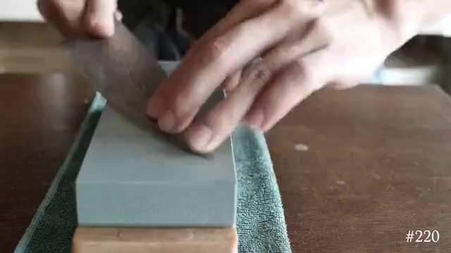
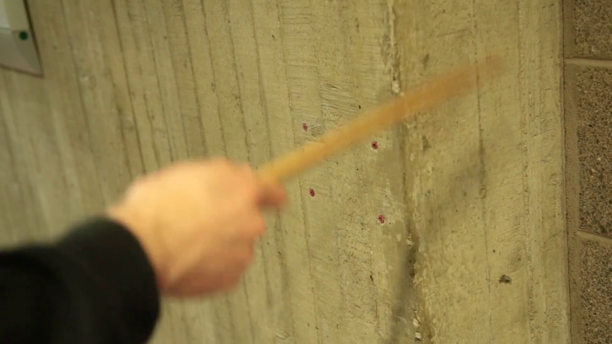
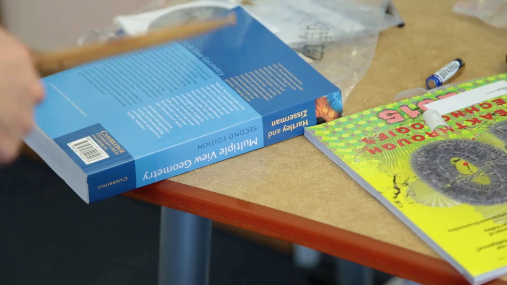
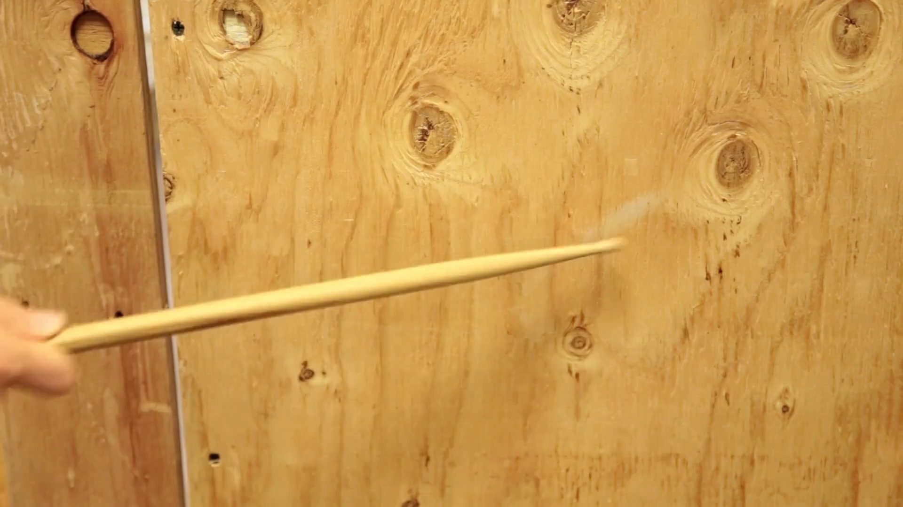

	<h2 class="pageTitle">AVSync15 Demos</h2>
	

    记得修改小节title和abstract
     
For each of the 15 categories in the AVSync test set, we selected an example video to show the results of different generation methods.
     
It is recommended to use earphones to hear the demos videos, raise the volume and zoom in the videos.
    

<h5 class="pageTitle" style="text-align: left;">Baby babbling crying.</h5>

<table border="0" width="320px" style="table-layout: fixed;"> <!-- 表格边框设置为1 -->
	<!--<tr>Sample 1: Playing the flute.</tr>-->
    <tr> <!-- 表格的一行 -->
        <th style="font-size:18px; font-weight: bold;"></th> <!-- 表头单元格 -->
 		<th style="font-size:18px; font-weight: bold;">I2V+I2A</th> <!-- 表头单元格 -->
        <th style="font-size:18px; font-weight: bold;">I2V2A</th> <!-- 表头单元格 -->
		<th style="font-size:18px; font-weight: bold;" >I2A2V</th> <!-- 表头单元格 -->
		<th style="font-size:18px; font-weight: bold;">I2VA</th> <!-- 表头单元格 -->
        <th style="font-size:18px; font-weight: bold;">I2VA</th> <!-- 表头单元格 -->
    </tr>
    <tr> <!-- 表格的一行 -->
        <th style="height:5px; font-size:15px">Input Image</th> <!-- 表头单元格 -->
 		<th style="height:5px; font-size:15px">SVD+AudioLDM-v</th> <!-- 表头单元格 -->
        <th style="height:5px; font-size:15px">SVD+SeeingHearing</th> <!-- 表头单元格 -->
		<th style="height:5px; font-size:15px">AudioLDM-v+AVSyncD</th> <!-- 表头单元格 -->
		<th style="height:5px; font-size:15px">CoDi</th> <!-- 表头单元格 -->
        <th style="height:5px; font-size:15px">Ours</th> <!-- 表头单元格 -->
    </tr>
    <tr> <!-- 表格的另一行 -->
        <td> <!-- 表格的单元格 -->
    		
        </td>
		<td> <!-- 表格的单元格 -->
            <video height="140" controls>
                <source src="./assets/video/avsync15/baby_babbling_crying/sample_svd+audioldmv.mp4" type="video/mp4">
                您的浏览器不支持视频标签。
            </video>
        </td>
		<td> <!-- 表格的单元格 -->
            <video height="140" controls>
                <source src="./assets/video/avsync15/baby_babbling_crying/sample_svd+seeing.mp4" type="video/mp4">
                您的浏览器不支持视频标签。
            </video>
        </td>
		<td> <!-- 表格的单元格 -->
            <video height="140" controls>
                <source src="./assets/video/avsync15/baby_babbling_crying/sample_audioldmv+avsyncd.mp4" type="video/mp4">
                您的浏览器不支持视频标签。
            </video>
        </td>
		<td> <!-- 表格的单元格 -->
            <video height="140" controls>
                <source src="./assets/video/avsync15/baby_babbling_crying/sample_codi.mp4" type="video/mp4">
                您的浏览器不支持视频标签。
            </video>
        </td>
		<td> <!-- 表格的单元格 -->
            <video height="140" controls>
                <source src="./assets/video/avsync15/baby_babbling_crying/sample_dualdit.mp4" type="video/mp4">
                您的浏览器不支持视频标签。
            </video>
        </td>
    </tr>
</table>

<h5 class="pageTitle" style="text-align: left;">Cap gun shooting.</h5>

<table border="0" width="400px" style="table-layout: fixed;"> <!-- 表格边框设置为1 -->
	<!--<tr>Sample 1: Playing the flute.</tr>-->
    <tr> <!-- 表格的一行 -->
        <th style="font-size:18px; font-weight: bold;"></th> <!-- 表头单元格 -->
 		<th style="font-size:18px; font-weight: bold;">I2V+I2A</th> <!-- 表头单元格 -->
        <th style="font-size:18px; font-weight: bold;">I2V2A</th> <!-- 表头单元格 -->
		<th style="font-size:18px; font-weight: bold;" >I2A2V</th> <!-- 表头单元格 -->
		<th style="font-size:18px; font-weight: bold;">I2VA</th> <!-- 表头单元格 -->
        <th style="font-size:18px; font-weight: bold;">I2VA</th> <!-- 表头单元格 -->
    </tr>
    <tr> <!-- 表格的一行 -->
        <th style="height:5px; font-size:15px">Input Image</th> <!-- 表头单元格 -->
 		<th style="height:5px; font-size:15px">SVD+AudioLDM-v</th> <!-- 表头单元格 -->
        <th style="height:5px; font-size:15px">SVD+SeeingHearing</th> <!-- 表头单元格 -->
		<th style="height:5px; font-size:15px">AudioLDM-v+AVSyncD</th> <!-- 表头单元格 -->
		<th style="height:5px; font-size:15px">CoDi</th> <!-- 表头单元格 -->
        <th style="height:5px; font-size:15px">Ours</th> <!-- 表头单元格 -->
    </tr>
    <tr> <!-- 表格的另一行 -->
        <td> <!-- 表格的单元格 -->
    		
        </td>
		<td> <!-- 表格的单元格 -->
            <video height="140" controls>
                <source src="./assets/video/avsync15/cap_gun_shooting/sample_svd+audioldmv.mp4" type="video/mp4">
                您的浏览器不支持视频标签。
            </video>
        </td>
		<td> <!-- 表格的单元格 -->
            <video height="140" controls>
                <source src="./assets/video/avsync15/cap_gun_shooting/sample_svd+seeing.mp4" type="video/mp4">
                您的浏览器不支持视频标签。
            </video>
        </td>
		<td> <!-- 表格的单元格 -->
            <video height="140" controls>
                <source src="./assets/video/avsync15/cap_gun_shooting/sample_audioldmv+avsyncd.mp4" type="video/mp4">
                您的浏览器不支持视频标签。
            </video>
        </td>
		<td> <!-- 表格的单元格 -->
            <video height="140" controls>
                <source src="./assets/video/avsync15/cap_gun_shooting/sample_codi.mp4" type="video/mp4">
                您的浏览器不支持视频标签。
            </video>
        </td>
		<td> <!-- 表格的单元格 -->
            <video height="140" controls>
                <source src="./assets/video/avsync15/cap_gun_shooting/sample_dualdit.mp4" type="video/mp4">
                您的浏览器不支持视频标签。
            </video>
        </td>
    </tr>
</table>

<h5 class="pageTitle" style="text-align: left;">Chicken crowing.</h5>

<table border="0" width="400px" style="table-layout: fixed;"> <!-- 表格边框设置为1 -->
	<!--<tr>Sample 1: Playing the flute.</tr>-->
    <tr> <!-- 表格的一行 -->
        <th style="font-size:18px; font-weight: bold;"></th> <!-- 表头单元格 -->
 		<th style="font-size:18px; font-weight: bold;">I2V+I2A</th> <!-- 表头单元格 -->
        <th style="font-size:18px; font-weight: bold;">I2V2A</th> <!-- 表头单元格 -->
		<th style="font-size:18px; font-weight: bold;" >I2A2V</th> <!-- 表头单元格 -->
		<th style="font-size:18px; font-weight: bold;">I2VA</th> <!-- 表头单元格 -->
        <th style="font-size:18px; font-weight: bold;">I2VA</th> <!-- 表头单元格 -->
    </tr>
    <tr> <!-- 表格的一行 -->
        <th style="height:5px; font-size:15px">Input Image</th> <!-- 表头单元格 -->
 		<th style="height:5px; font-size:15px">SVD+AudioLDM-v</th> <!-- 表头单元格 -->
        <th style="height:5px; font-size:15px">SVD+SeeingHearing</th> <!-- 表头单元格 -->
		<th style="height:5px; font-size:15px">AudioLDM-v+AVSyncD</th> <!-- 表头单元格 -->
		<th style="height:5px; font-size:15px">CoDi</th> <!-- 表头单元格 -->
        <th style="height:5px; font-size:15px">Ours</th> <!-- 表头单元格 -->
    </tr>
    <tr> <!-- 表格的另一行 -->
        <td> <!-- 表格的单元格 -->
    		
        </td>
		<td> <!-- 表格的单元格 -->
            <video height="140" controls>
                <source src="./assets/video/avsync15/chicken_crowing/sample_svd+audioldmv.mp4" type="video/mp4">
                您的浏览器不支持视频标签。
            </video>
        </td>
		<td> <!-- 表格的单元格 -->
            <video height="140" controls>
                <source src="./assets/video/avsync15/chicken_crowing/sample_svd+seeing.mp4" type="video/mp4">
                您的浏览器不支持视频标签。
            </video>
        </td>
		<td> <!-- 表格的单元格 -->
            <video height="140" controls>
                <source src="./assets/video/avsync15/chicken_crowing/sample_audioldmv+avsyncd.mp4" type="video/mp4">
                您的浏览器不支持视频标签。
            </video>
        </td>
		<td> <!-- 表格的单元格 -->
            <video height="140" controls>
                <source src="./assets/video/avsync15/chicken_crowing/sample_codi.mp4" type="video/mp4">
                您的浏览器不支持视频标签。
            </video>
        </td>
		<td> <!-- 表格的单元格 -->
            <video height="140" controls>
                <source src="./assets/video/avsync15/chicken_crowing/sample_dualdit.mp4" type="video/mp4">
                您的浏览器不支持视频标签。
            </video>
        </td>
    </tr>
</table>

<h5 class="pageTitle" style="text-align: left;">Dog barking.</h5>

<table border="0" width="400px" style="table-layout: fixed;"> <!-- 表格边框设置为1 -->
	<!--<tr>Sample 1: Playing the flute.</tr>-->
    <tr> <!-- 表格的一行 -->
        <th style="font-size:18px; font-weight: bold;"></th> <!-- 表头单元格 -->
 		<th style="font-size:18px; font-weight: bold;">I2V+I2A</th> <!-- 表头单元格 -->
        <th style="font-size:18px; font-weight: bold;">I2V2A</th> <!-- 表头单元格 -->
		<th style="font-size:18px; font-weight: bold;" >I2A2V</th> <!-- 表头单元格 -->
		<th style="font-size:18px; font-weight: bold;">I2VA</th> <!-- 表头单元格 -->
        <th style="font-size:18px; font-weight: bold;">I2VA</th> <!-- 表头单元格 -->
    </tr>
    <tr> <!-- 表格的一行 -->
        <th style="height:5px; font-size:15px">Input Image</th> <!-- 表头单元格 -->
 		<th style="height:5px; font-size:15px">SVD+AudioLDM-v</th> <!-- 表头单元格 -->
        <th style="height:5px; font-size:15px">SVD+SeeingHearing</th> <!-- 表头单元格 -->
		<th style="height:5px; font-size:15px">AudioLDM-v+AVSyncD</th> <!-- 表头单元格 -->
		<th style="height:5px; font-size:15px">CoDi</th> <!-- 表头单元格 -->
        <th style="height:5px; font-size:15px">Ours</th> <!-- 表头单元格 -->
    </tr>
    <tr> <!-- 表格的另一行 -->
        <td> <!-- 表格的单元格 -->
    		
        </td>
		<td> <!-- 表格的单元格 -->
            <video height="140" controls>
                <source src="./assets/video/avsync15/dog_barking/sample_svd+audioldmv.mp4" type="video/mp4">
                您的浏览器不支持视频标签。
            </video>
        </td>
		<td> <!-- 表格的单元格 -->
            <video height="140" controls>
                <source src="./assets/video/avsync15/dog_barking/sample_svd+seeing.mp4" type="video/mp4">
                您的浏览器不支持视频标签。
            </video>
        </td>
		<td> <!-- 表格的单元格 -->
            <video height="140" controls>
                <source src="./assets/video/avsync15/dog_barking/sample_audioldmv+avsyncd.mp4" type="video/mp4">
                您的浏览器不支持视频标签。
            </video>
        </td>
		<td> <!-- 表格的单元格 -->
            <video height="140" controls>
                <source src="./assets/video/avsync15/dog_barking/sample_codi.mp4" type="video/mp4">
                您的浏览器不支持视频标签。
            </video>
        </td>
		<td> <!-- 表格的单元格 -->
            <video height="140" controls>
                <source src="./assets/video/avsync15/dog_barking/sample_dualdit.mp4" type="video/mp4">
                您的浏览器不支持视频标签。
            </video>
        </td>
    </tr>
</table>

<h5 class="pageTitle" style="text-align: left;">Frog croaking.</h5>

<table border="0" width="400px" style="table-layout: fixed;"> <!-- 表格边框设置为1 -->
	<!--<tr>Sample 1: Playing the flute.</tr>-->
    <tr> <!-- 表格的一行 -->
        <th style="font-size:18px; font-weight: bold;"></th> <!-- 表头单元格 -->
 		<th style="font-size:18px; font-weight: bold;">I2V+I2A</th> <!-- 表头单元格 -->
        <th style="font-size:18px; font-weight: bold;">I2V2A</th> <!-- 表头单元格 -->
		<th style="font-size:18px; font-weight: bold;" >I2A2V</th> <!-- 表头单元格 -->
		<th style="font-size:18px; font-weight: bold;">I2VA</th> <!-- 表头单元格 -->
        <th style="font-size:18px; font-weight: bold;">I2VA</th> <!-- 表头单元格 -->
    </tr>
    <tr> <!-- 表格的一行 -->
        <th style="height:5px; font-size:15px">Input Image</th> <!-- 表头单元格 -->
 		<th style="height:5px; font-size:15px">SVD+AudioLDM-v</th> <!-- 表头单元格 -->
        <th style="height:5px; font-size:15px">SVD+SeeingHearing</th> <!-- 表头单元格 -->
		<th style="height:5px; font-size:15px">AudioLDM-v+AVSyncD</th> <!-- 表头单元格 -->
		<th style="height:5px; font-size:15px">CoDi</th> <!-- 表头单元格 -->
        <th style="height:5px; font-size:15px">Ours</th> <!-- 表头单元格 -->
    </tr>
    <tr> <!-- 表格的另一行 -->
        <td> <!-- 表格的单元格 -->
    		
        </td>
		<td> <!-- 表格的单元格 -->
            <video height="140" controls>
                <source src="./assets/video/avsync15/frog_croaking/sample_svd+audioldmv.mp4" type="video/mp4">
                您的浏览器不支持视频标签。
            </video>
        </td>
		<td> <!-- 表格的单元格 -->
            <video height="140" controls>
                <source src="./assets/video/avsync15/frog_croaking/sample_svd+seeing.mp4" type="video/mp4">
                您的浏览器不支持视频标签。
            </video>
        </td>
		<td> <!-- 表格的单元格 -->
            <video height="140" controls>
                <source src="./assets/video/avsync15/frog_croaking/sample_audioldmv+avsyncd.mp4" type="video/mp4">
                您的浏览器不支持视频标签。
            </video>
        </td>
		<td> <!-- 表格的单元格 -->
            <video height="140" controls>
                <source src="./assets/video/avsync15/frog_croaking/sample_codi.mp4" type="video/mp4">
                您的浏览器不支持视频标签。
            </video>
        </td>
		<td> <!-- 表格的单元格 -->
            <video height="140" controls>
                <source src="./assets/video/avsync15/frog_croaking/sample_dualdit.mp4" type="video/mp4">
                您的浏览器不支持视频标签。
            </video>
        </td>
    </tr>
</table>

<h5 class="pageTitle" style="text-align: left;">Hammering.</h5>

<table border="0" width="400px" style="table-layout: fixed;"> <!-- 表格边框设置为1 -->
	<!--<tr>Sample 1: Playing the flute.</tr>-->
    <tr> <!-- 表格的一行 -->
        <th style="font-size:18px; font-weight: bold;"></th> <!-- 表头单元格 -->
 		<th style="font-size:18px; font-weight: bold;">I2V+I2A</th> <!-- 表头单元格 -->
        <th style="font-size:18px; font-weight: bold;">I2V2A</th> <!-- 表头单元格 -->
		<th style="font-size:18px; font-weight: bold;" >I2A2V</th> <!-- 表头单元格 -->
		<th style="font-size:18px; font-weight: bold;">I2VA</th> <!-- 表头单元格 -->
        <th style="font-size:18px; font-weight: bold;">I2VA</th> <!-- 表头单元格 -->
    </tr>
    <tr> <!-- 表格的一行 -->
        <th style="height:5px; font-size:15px">Input Image</th> <!-- 表头单元格 -->
 		<th style="height:5px; font-size:15px">SVD+AudioLDM-v</th> <!-- 表头单元格 -->
        <th style="height:5px; font-size:15px">SVD+SeeingHearing</th> <!-- 表头单元格 -->
		<th style="height:5px; font-size:15px">AudioLDM-v+AVSyncD</th> <!-- 表头单元格 -->
		<th style="height:5px; font-size:15px">CoDi</th> <!-- 表头单元格 -->
        <th style="height:5px; font-size:15px">Ours</th> <!-- 表头单元格 -->
    </tr>
    <tr> <!-- 表格的另一行 -->
        <td> <!-- 表格的单元格 -->
    		
        </td>
		<td> <!-- 表格的单元格 -->
            <video height="140" controls>
                <source src="./assets/video/avsync15/hammering/sample_svd+audioldmv.mp4" type="video/mp4">
                您的浏览器不支持视频标签。
            </video>
        </td>
		<td> <!-- 表格的单元格 -->
            <video height="140" controls>
                <source src="./assets/video/avsync15/hammering/sample_svd+seeing.mp4" type="video/mp4">
                您的浏览器不支持视频标签。
            </video>
        </td>
		<td> <!-- 表格的单元格 -->
            <video height="140" controls>
                <source src="./assets/video/avsync15/hammering/sample_audioldmv+avsyncd.mp4" type="video/mp4">
                您的浏览器不支持视频标签。
            </video>
        </td>
		<td> <!-- 表格的单元格 -->
            <video height="140" controls>
                <source src="./assets/video/avsync15/hammering/sample_codi.mp4" type="video/mp4">
                您的浏览器不支持视频标签。
            </video>
        </td>
		<td> <!-- 表格的单元格 -->
            <video height="140" controls>
                <source src="./assets/video/avsync15/hammering/sample_dualdit.mp4" type="video/mp4">
                您的浏览器不支持视频标签。
            </video>
        </td>
    </tr>
</table>

<h5 class="pageTitle" style="text-align: left;">Lions roaring.</h5>

<table border="0" width="400px" style="table-layout: fixed;"> <!-- 表格边框设置为1 -->
	<!--<tr>Sample 1: Playing the flute.</tr>-->
    <tr> <!-- 表格的一行 -->
        <th style="font-size:18px; font-weight: bold;"></th> <!-- 表头单元格 -->
 		<th style="font-size:18px; font-weight: bold;">I2V+I2A</th> <!-- 表头单元格 -->
        <th style="font-size:18px; font-weight: bold;">I2V2A</th> <!-- 表头单元格 -->
		<th style="font-size:18px; font-weight: bold;" >I2A2V</th> <!-- 表头单元格 -->
		<th style="font-size:18px; font-weight: bold;">I2VA</th> <!-- 表头单元格 -->
        <th style="font-size:18px; font-weight: bold;">I2VA</th> <!-- 表头单元格 -->
    </tr>
    <tr> <!-- 表格的一行 -->
        <th style="height:5px; font-size:15px">Input Image</th> <!-- 表头单元格 -->
 		<th style="height:5px; font-size:15px">SVD+AudioLDM-v</th> <!-- 表头单元格 -->
        <th style="height:5px; font-size:15px">SVD+SeeingHearing</th> <!-- 表头单元格 -->
		<th style="height:5px; font-size:15px">AudioLDM-v+AVSyncD</th> <!-- 表头单元格 -->
		<th style="height:5px; font-size:15px">CoDi</th> <!-- 表头单元格 -->
        <th style="height:5px; font-size:15px">Ours</th> <!-- 表头单元格 -->
    </tr>
    <tr> <!-- 表格的另一行 -->
        <td> <!-- 表格的单元格 -->
    		
        </td>
		<td> <!-- 表格的单元格 -->
            <video height="140" controls>
                <source src="./assets/video/avsync15/lions_roaring/sample_svd+audioldmv.mp4" type="video/mp4">
                您的浏览器不支持视频标签。
            </video>
        </td>
		<td> <!-- 表格的单元格 -->
            <video height="140" controls>
                <source src="./assets/video/avsync15/lions_roaring/sample_svd+seeing.mp4" type="video/mp4">
                您的浏览器不支持视频标签。
            </video>
        </td>
		<td> <!-- 表格的单元格 -->
            <video height="140" controls>
                <source src="./assets/video/avsync15/lions_roaring/sample_audioldmv+avsyncd.mp4" type="video/mp4">
                您的浏览器不支持视频标签。
            </video>
        </td>
		<td> <!-- 表格的单元格 -->
            <video height="140" controls>
                <source src="./assets/video/avsync15/lions_roaring/sample_codi.mp4" type="video/mp4">
                您的浏览器不支持视频标签。
            </video>
        </td>
		<td> <!-- 表格的单元格 -->
            <video height="140" controls>
                <source src="./assets/video/avsync15/lions_roaring/sample_dualdit.mp4" type="video/mp4">
                您的浏览器不支持视频标签。
            </video>
        </td>
    </tr>
</table>

<h5 class="pageTitle" style="text-align: left;">Machine gun shooting.</h5>

<table border="0" width="400px" style="table-layout: fixed;"> <!-- 表格边框设置为1 -->
	<!--<tr>Sample 1: Playing the flute.</tr>-->
    <tr> <!-- 表格的一行 -->
        <th style="font-size:18px; font-weight: bold;"></th> <!-- 表头单元格 -->
 		<th style="font-size:18px; font-weight: bold;">I2V+I2A</th> <!-- 表头单元格 -->
        <th style="font-size:18px; font-weight: bold;">I2V2A</th> <!-- 表头单元格 -->
		<th style="font-size:18px; font-weight: bold;" >I2A2V</th> <!-- 表头单元格 -->
		<th style="font-size:18px; font-weight: bold;">I2VA</th> <!-- 表头单元格 -->
        <th style="font-size:18px; font-weight: bold;">I2VA</th> <!-- 表头单元格 -->
    </tr>
    <tr> <!-- 表格的一行 -->
        <th style="height:5px; font-size:15px">Input Image</th> <!-- 表头单元格 -->
 		<th style="height:5px; font-size:15px">SVD+AudioLDM-v</th> <!-- 表头单元格 -->
        <th style="height:5px; font-size:15px">SVD+SeeingHearing</th> <!-- 表头单元格 -->
		<th style="height:5px; font-size:15px">AudioLDM-v+AVSyncD</th> <!-- 表头单元格 -->
		<th style="height:5px; font-size:15px">CoDi</th> <!-- 表头单元格 -->
        <th style="height:5px; font-size:15px">Ours</th> <!-- 表头单元格 -->
    </tr>
    <tr> <!-- 表格的另一行 -->
        <td> <!-- 表格的单元格 -->
    		
        </td>
		<td> <!-- 表格的单元格 -->
            <video height="140" controls>
                <source src="./assets/video/avsync15/machine_gun_shooting/sample_svd+audioldmv.mp4" type="video/mp4">
                您的浏览器不支持视频标签。
            </video>
        </td>
		<td> <!-- 表格的单元格 -->
            <video height="140" controls>
                <source src="./assets/video/avsync15/machine_gun_shooting/sample_svd+seeing.mp4" type="video/mp4">
                您的浏览器不支持视频标签。
            </video>
        </td>
		<td> <!-- 表格的单元格 -->
            <video height="140" controls>
                <source src="./assets/video/avsync15/machine_gun_shooting/sample_audioldmv+avsyncd.mp4" type="video/mp4">
                您的浏览器不支持视频标签。
            </video>
        </td>
		<td> <!-- 表格的单元格 -->
            <video height="140" controls>
                <source src="./assets/video/avsync15/machine_gun_shooting/sample_codi.mp4" type="video/mp4">
                您的浏览器不支持视频标签。
            </video>
        </td>
		<td> <!-- 表格的单元格 -->
            <video height="140" controls>
                <source src="./assets/video/avsync15/machine_gun_shooting/sample_dualdit.mp4" type="video/mp4">
                您的浏览器不支持视频标签。
            </video>
        </td>
    </tr>
</table>

<h5 class="pageTitle" style="text-align: left;">Playing cello.</h5>

<table border="0" width="400px" style="table-layout: fixed;"> <!-- 表格边框设置为1 -->
	<!--<tr>Sample 1: Playing the flute.</tr>-->
    <tr> <!-- 表格的一行 -->
        <th style="font-size:18px; font-weight: bold;"></th> <!-- 表头单元格 -->
 		<th style="font-size:18px; font-weight: bold;">I2V+I2A</th> <!-- 表头单元格 -->
        <th style="font-size:18px; font-weight: bold;">I2V2A</th> <!-- 表头单元格 -->
		<th style="font-size:18px; font-weight: bold;" >I2A2V</th> <!-- 表头单元格 -->
		<th style="font-size:18px; font-weight: bold;">I2VA</th> <!-- 表头单元格 -->
        <th style="font-size:18px; font-weight: bold;">I2VA</th> <!-- 表头单元格 -->
    </tr>
    <tr> <!-- 表格的一行 -->
        <th style="height:5px; font-size:15px">Input Image</th> <!-- 表头单元格 -->
 		<th style="height:5px; font-size:15px">SVD+AudioLDM-v</th> <!-- 表头单元格 -->
        <th style="height:5px; font-size:15px">SVD+SeeingHearing</th> <!-- 表头单元格 -->
		<th style="height:5px; font-size:15px">AudioLDM-v+AVSyncD</th> <!-- 表头单元格 -->
		<th style="height:5px; font-size:15px">CoDi</th> <!-- 表头单元格 -->
        <th style="height:5px; font-size:15px">Ours</th> <!-- 表头单元格 -->
    </tr>
    <tr> <!-- 表格的另一行 -->
        <td> <!-- 表格的单元格 -->
    		
        </td>
		<td> <!-- 表格的单元格 -->
            <video height="140" controls>
                <source src="./assets/video/avsync15/playing_cello/sample_svd+audioldmv.mp4" type="video/mp4">
                您的浏览器不支持视频标签。
            </video>
        </td>
		<td> <!-- 表格的单元格 -->
            <video height="140" controls>
                <source src="./assets/video/avsync15/playing_cello/sample_svd+seeing.mp4" type="video/mp4">
                您的浏览器不支持视频标签。
            </video>
        </td>
		<td> <!-- 表格的单元格 -->
            <video height="140" controls>
                <source src="./assets/video/avsync15/playing_cello/sample_audioldmv+avsyncd.mp4" type="video/mp4">
                您的浏览器不支持视频标签。
            </video>
        </td>
		<td> <!-- 表格的单元格 -->
            <video height="140" controls>
                <source src="./assets/video/avsync15/playing_cello/sample_codi.mp4" type="video/mp4">
                您的浏览器不支持视频标签。
            </video>
        </td>
		<td> <!-- 表格的单元格 -->
            <video height="140" controls>
                <source src="./assets/video/avsync15/playing_cello/sample_dualdit.mp4" type="video/mp4">
                您的浏览器不支持视频标签。
            </video>
        </td>
    </tr>
</table>

<h5 class="pageTitle" style="text-align: left;">Playing trombone.</h5>

<table border="0" width="400px" style="table-layout: fixed;"> <!-- 表格边框设置为1 -->
	<!--<tr>Sample 1: Playing the flute.</tr>-->
    <tr> <!-- 表格的一行 -->
        <th style="font-size:18px; font-weight: bold;"></th> <!-- 表头单元格 -->
 		<th style="font-size:18px; font-weight: bold;">I2V+I2A</th> <!-- 表头单元格 -->
        <th style="font-size:18px; font-weight: bold;">I2V2A</th> <!-- 表头单元格 -->
		<th style="font-size:18px; font-weight: bold;" >I2A2V</th> <!-- 表头单元格 -->
		<th style="font-size:18px; font-weight: bold;">I2VA</th> <!-- 表头单元格 -->
        <th style="font-size:18px; font-weight: bold;">I2VA</th> <!-- 表头单元格 -->
    </tr>
    <tr> <!-- 表格的一行 -->
        <th style="height:5px; font-size:15px">Input Image</th> <!-- 表头单元格 -->
 		<th style="height:5px; font-size:15px">SVD+AudioLDM-v</th> <!-- 表头单元格 -->
        <th style="height:5px; font-size:15px">SVD+SeeingHearing</th> <!-- 表头单元格 -->
		<th style="height:5px; font-size:15px">AudioLDM-v+AVSyncD</th> <!-- 表头单元格 -->
		<th style="height:5px; font-size:15px">CoDi</th> <!-- 表头单元格 -->
        <th style="height:5px; font-size:15px">Ours</th> <!-- 表头单元格 -->
    </tr>
    <tr> <!-- 表格的另一行 -->
        <td> <!-- 表格的单元格 -->
    		
        </td>
		<td> <!-- 表格的单元格 -->
            <video height="140" controls>
                <source src="./assets/video/avsync15/playing_trombone/sample_svd+audioldmv.mp4" type="video/mp4">
                您的浏览器不支持视频标签。
            </video>
        </td>
		<td> <!-- 表格的单元格 -->
            <video height="140" controls>
                <source src="./assets/video/avsync15/playing_trombone/sample_svd+seeing.mp4" type="video/mp4">
                您的浏览器不支持视频标签。
            </video>
        </td>
		<td> <!-- 表格的单元格 -->
            <video height="140" controls>
                <source src="./assets/video/avsync15/playing_trombone/sample_audioldmv+avsyncd.mp4" type="video/mp4">
                您的浏览器不支持视频标签。
            </video>
        </td>
		<td> <!-- 表格的单元格 -->
            <video height="140" controls>
                <source src="./assets/video/avsync15/playing_trombone/sample_codi.mp4" type="video/mp4">
                您的浏览器不支持视频标签。
            </video>
        </td>
		<td> <!-- 表格的单元格 -->
            <video height="140" controls>
                <source src="./assets/video/avsync15/playing_trombone/sample_dualdit.mp4" type="video/mp4">
                您的浏览器不支持视频标签。
            </video>
        </td>
    </tr>
</table>

<h5 class="pageTitle" style="text-align: left;">Playing trumpet.</h5>

<table border="0" width="400px" style="table-layout: fixed;"> <!-- 表格边框设置为1 -->
	<!--<tr>Sample 1: Playing the flute.</tr>-->
    <tr> <!-- 表格的一行 -->
        <th style="font-size:18px; font-weight: bold;"></th> <!-- 表头单元格 -->
 		<th style="font-size:18px; font-weight: bold;">I2V+I2A</th> <!-- 表头单元格 -->
        <th style="font-size:18px; font-weight: bold;">I2V2A</th> <!-- 表头单元格 -->
		<th style="font-size:18px; font-weight: bold;" >I2A2V</th> <!-- 表头单元格 -->
		<th style="font-size:18px; font-weight: bold;">I2VA</th> <!-- 表头单元格 -->
        <th style="font-size:18px; font-weight: bold;">I2VA</th> <!-- 表头单元格 -->
    </tr>
    <tr> <!-- 表格的一行 -->
        <th style="height:5px; font-size:15px">Input Image</th> <!-- 表头单元格 -->
 		<th style="height:5px; font-size:15px">SVD+AudioLDM-v</th> <!-- 表头单元格 -->
        <th style="height:5px; font-size:15px">SVD+SeeingHearing</th> <!-- 表头单元格 -->
		<th style="height:5px; font-size:15px">AudioLDM-v+AVSyncD</th> <!-- 表头单元格 -->
		<th style="height:5px; font-size:15px">CoDi</th> <!-- 表头单元格 -->
        <th style="height:5px; font-size:15px">Ours</th> <!-- 表头单元格 -->
    </tr>
    <tr> <!-- 表格的另一行 -->
        <td> <!-- 表格的单元格 -->
    		
        </td>
		<td> <!-- 表格的单元格 -->
            <video height="140" controls>
                <source src="./assets/video/avsync15/playing_trumpet/sample_svd+audioldmv.mp4" type="video/mp4">
                您的浏览器不支持视频标签。
            </video>
        </td>
		<td> <!-- 表格的单元格 -->
            <video height="140" controls>
                <source src="./assets/video/avsync15/playing_trumpet/sample_svd+seeing.mp4" type="video/mp4">
                您的浏览器不支持视频标签。
            </video>
        </td>
		<td> <!-- 表格的单元格 -->
            <video height="140" controls>
                <source src="./assets/video/avsync15/playing_trumpet/sample_audioldmv+avsyncd.mp4" type="video/mp4">
                您的浏览器不支持视频标签。
            </video>
        </td>
		<td> <!-- 表格的单元格 -->
            <video height="140" controls>
                <source src="./assets/video/avsync15/playing_trumpet/sample_codi.mp4" type="video/mp4">
                您的浏览器不支持视频标签。
            </video>
        </td>
		<td> <!-- 表格的单元格 -->
            <video height="140" controls>
                <source src="./assets/video/avsync15/playing_trumpet/sample_dualdit.mp4" type="video/mp4">
                您的浏览器不支持视频标签。
            </video>
        </td>
    </tr>
</table>

<h5 class="pageTitle" style="text-align: left;">Playing violin fiddle.</h5>

<table border="0" width="400px" style="table-layout: fixed;"> <!-- 表格边框设置为1 -->
	<!--<tr>Sample 1: Playing the flute.</tr>-->
    <tr> <!-- 表格的一行 -->
        <th style="font-size:18px; font-weight: bold;"></th> <!-- 表头单元格 -->
 		<th style="font-size:18px; font-weight: bold;">I2V+I2A</th> <!-- 表头单元格 -->
        <th style="font-size:18px; font-weight: bold;">I2V2A</th> <!-- 表头单元格 -->
		<th style="font-size:18px; font-weight: bold;" >I2A2V</th> <!-- 表头单元格 -->
		<th style="font-size:18px; font-weight: bold;">I2VA</th> <!-- 表头单元格 -->
        <th style="font-size:18px; font-weight: bold;">I2VA</th> <!-- 表头单元格 -->
    </tr>
    <tr> <!-- 表格的一行 -->
        <th style="height:5px; font-size:15px">Input Image</th> <!-- 表头单元格 -->
 		<th style="height:5px; font-size:15px">SVD+AudioLDM-v</th> <!-- 表头单元格 -->
        <th style="height:5px; font-size:15px">SVD+SeeingHearing</th> <!-- 表头单元格 -->
		<th style="height:5px; font-size:15px">AudioLDM-v+AVSyncD</th> <!-- 表头单元格 -->
		<th style="height:5px; font-size:15px">CoDi</th> <!-- 表头单元格 -->
        <th style="height:5px; font-size:15px">Ours</th> <!-- 表头单元格 -->
    </tr>
    <tr> <!-- 表格的另一行 -->
        <td> <!-- 表格的单元格 -->
    		
        </td>
		<td> <!-- 表格的单元格 -->
            <video height="120" controls>
                <source src="./assets/video/avsync15/playing_violin__fiddle/sample_svd+audioldmv.mp4" type="video/mp4">
                您的浏览器不支持视频标签。
            </video>
        </td>
		<td> <!-- 表格的单元格 -->
            <video height="140" controls>
                <source src="./assets/video/avsync15/playing_violin__fiddle/sample_svd+seeing.mp4" type="video/mp4">
                您的浏览器不支持视频标签。
            </video>
        </td>
		<td> <!-- 表格的单元格 -->
            <video height="140" controls>
                <source src="./assets/video/avsync15/playing_violin__fiddle/sample_audioldmv+avsyncd.mp4" type="video/mp4">
                您的浏览器不支持视频标签。
            </video>
        </td>
		<td> <!-- 表格的单元格 -->
            <video height="140" controls>
                <source src="./assets/video/avsync15/playing_violin__fiddle/sample_codi.mp4" type="video/mp4">
                您的浏览器不支持视频标签。
            </video>
        </td>
		<td> <!-- 表格的单元格 -->
            <video height="140" controls>
                <source src="./assets/video/avsync15/playing_violin__fiddle/sample_dualdit.mp4" type="video/mp4">
                您的浏览器不支持视频标签。
            </video>
        </td>
    </tr>
</table>

<h5 class="pageTitle" style="text-align: left;">Sharpen knife.</h5>

<table border="0" width="400px" style="table-layout: fixed;"> <!-- 表格边框设置为1 -->
	<!--<tr>Sample 1: Playing the flute.</tr>-->
    <tr> <!-- 表格的一行 -->
        <th style="font-size:18px; font-weight: bold;"></th> <!-- 表头单元格 -->
 		<th style="font-size:18px; font-weight: bold;">I2V+I2A</th> <!-- 表头单元格 -->
        <th style="font-size:18px; font-weight: bold;">I2V2A</th> <!-- 表头单元格 -->
		<th style="font-size:18px; font-weight: bold;" >I2A2V</th> <!-- 表头单元格 -->
		<th style="font-size:18px; font-weight: bold;">I2VA</th> <!-- 表头单元格 -->
        <th style="font-size:18px; font-weight: bold;">I2VA</th> <!-- 表头单元格 -->
    </tr>
    <tr> <!-- 表格的一行 -->
        <th style="height:5px; font-size:15px">Input Image</th> <!-- 表头单元格 -->
 		<th style="height:5px; font-size:15px">SVD+AudioLDM-v</th> <!-- 表头单元格 -->
        <th style="height:5px; font-size:15px">SVD+SeeingHearing</th> <!-- 表头单元格 -->
		<th style="height:5px; font-size:15px">AudioLDM-v+AVSyncD</th> <!-- 表头单元格 -->
		<th style="height:5px; font-size:15px">CoDi</th> <!-- 表头单元格 -->
        <th style="height:5px; font-size:15px">Ours</th> <!-- 表头单元格 -->
    </tr>
    <tr> <!-- 表格的另一行 -->
        <td> <!-- 表格的单元格 -->
    		
        </td>
		<td> <!-- 表格的单元格 -->
            <video height="120" controls>
                <source src="./assets/video/avsync15/sharpen_knife/sample_svd+audioldmv.mp4" type="video/mp4">
                您的浏览器不支持视频标签。
            </video>
        </td>
		<td> <!-- 表格的单元格 -->
            <video height="140" controls>
                <source src="./assets/video/avsync15/sharpen_knife/sample_svd+seeing.mp4" type="video/mp4">
                您的浏览器不支持视频标签。
            </video>
        </td>
		<td> <!-- 表格的单元格 -->
            <video height="140" controls>
                <source src="./assets/video/avsync15/sharpen_knife/sample_audioldmv+avsyncd.mp4" type="video/mp4">
                您的浏览器不支持视频标签。
            </video>
        </td>
		<td> <!-- 表格的单元格 -->
            <video height="140" controls>
                <source src="./assets/video/avsync15/sharpen_knife/sample_codi.mp4" type="video/mp4">
                您的浏览器不支持视频标签。
            </video>
        </td>
		<td> <!-- 表格的单元格 -->
            <video height="140" controls>
                <source src="./assets/video/avsync15/sharpen_knife/sample_dualdit.mp4" type="video/mp4">
                您的浏览器不支持视频标签。
            </video>
        </td>
    </tr>
</table>

<h5 class="pageTitle" style="text-align: left;">Striking bowling.</h5>

<table border="0" width="400px" style="table-layout: fixed;"> <!-- 表格边框设置为1 -->
	<!--<tr>Sample 1: Playing the flute.</tr>-->
    <tr> <!-- 表格的一行 -->
        <th style="font-size:18px; font-weight: bold;"></th> <!-- 表头单元格 -->
 		<th style="font-size:18px; font-weight: bold;">I2V+I2A</th> <!-- 表头单元格 -->
        <th style="font-size:18px; font-weight: bold;">I2V2A</th> <!-- 表头单元格 -->
		<th style="font-size:18px; font-weight: bold;" >I2A2V</th> <!-- 表头单元格 -->
		<th style="font-size:18px; font-weight: bold;">I2VA</th> <!-- 表头单元格 -->
        <th style="font-size:18px; font-weight: bold;">I2VA</th> <!-- 表头单元格 -->
    </tr>
    <tr> <!-- 表格的一行 -->
        <th style="height:5px; font-size:15px">Input Image</th> <!-- 表头单元格 -->
 		<th style="height:5px; font-size:15px">SVD+AudioLDM-v</th> <!-- 表头单元格 -->
        <th style="height:5px; font-size:15px">SVD+SeeingHearing</th> <!-- 表头单元格 -->
		<th style="height:5px; font-size:15px">AudioLDM-v+AVSyncD</th> <!-- 表头单元格 -->
		<th style="height:5px; font-size:15px">CoDi</th> <!-- 表头单元格 -->
        <th style="height:5px; font-size:15px">Ours</th> <!-- 表头单元格 -->
    </tr>
    <tr> <!-- 表格的另一行 -->
        <td> <!-- 表格的单元格 -->
    		
        </td>
		<td> <!-- 表格的单元格 -->
            <video height="140" controls>
                <source src="./assets/video/avsync15/striking_bowling/sample_svd+audioldmv.mp4" type="video/mp4">
                您的浏览器不支持视频标签。
            </video>
        </td>
		<td> <!-- 表格的单元格 -->
            <video height="140" controls>
                <source src="./assets/video/avsync15/striking_bowling/sample_svd+seeing.mp4" type="video/mp4">
                您的浏览器不支持视频标签。
            </video>
        </td>
		<td> <!-- 表格的单元格 -->
            <video height="140" controls>
                <source src="./assets/video/avsync15/striking_bowling/sample_audioldmv+avsyncd.mp4" type="video/mp4">
                您的浏览器不支持视频标签。
            </video>
        </td>
		<td> <!-- 表格的单元格 -->
            <video height="140" controls>
                <source src="./assets/video/avsync15/striking_bowling/sample_codi.mp4" type="video/mp4">
                您的浏览器不支持视频标签。
            </video>
        </td>
		<td> <!-- 表格的单元格 -->
            <video height="140" controls>
                <source src="./assets/video/avsync15/striking_bowling/sample_dualdit.mp4" type="video/mp4">
                您的浏览器不支持视频标签。
            </video>
        </td>
    </tr>
</table>

<h5 class="pageTitle" style="text-align: left;">Toilet flushing.</h5>

<table border="0" width="400px" style="table-layout: fixed;"> <!-- 表格边框设置为1 -->
	<!--<tr>Sample 1: Playing the flute.</tr>-->
    <tr> <!-- 表格的一行 -->
        <th style="font-size:18px; font-weight: bold;"></th> <!-- 表头单元格 -->
 		<th style="font-size:18px; font-weight: bold;">I2V+I2A</th> <!-- 表头单元格 -->
        <th style="font-size:18px; font-weight: bold;">I2V2A</th> <!-- 表头单元格 -->
		<th style="font-size:18px; font-weight: bold;" >I2A2V</th> <!-- 表头单元格 -->
		<th style="font-size:18px; font-weight: bold;">I2VA</th> <!-- 表头单元格 -->
        <th style="font-size:18px; font-weight: bold;">I2VA</th> <!-- 表头单元格 -->
    </tr>
    <tr> <!-- 表格的一行 -->
        <th style="height:5px; font-size:15px">Input Image</th> <!-- 表头单元格 -->
 		<th style="height:5px; font-size:15px">SVD+AudioLDM-v</th> <!-- 表头单元格 -->
        <th style="height:5px; font-size:15px">SVD+SeeingHearing</th> <!-- 表头单元格 -->
		<th style="height:5px; font-size:15px">AudioLDM-v+AVSyncD</th> <!-- 表头单元格 -->
		<th style="height:5px; font-size:15px">CoDi</th> <!-- 表头单元格 -->
        <th style="height:5px; font-size:15px">Ours</th> <!-- 表头单元格 -->
    </tr>
    <tr> <!-- 表格的另一行 -->
        <td> <!-- 表格的单元格 -->
    		
        </td>
		<td> <!-- 表格的单元格 -->
            <video height="140" controls>
                <source src="./assets/video/avsync15/toilet_flushing/sample_svd+audioldmv.mp4" type="video/mp4">
                您的浏览器不支持视频标签。
            </video>
        </td>
		<td> <!-- 表格的单元格 -->
            <video height="140" controls>
                <source src="./assets/video/avsync15/toilet_flushing/sample_svd+seeing.mp4" type="video/mp4">
                您的浏览器不支持视频标签。
            </video>
        </td>
		<td> <!-- 表格的单元格 -->
            <video height="140" controls>
                <source src="./assets/video/avsync15/toilet_flushing/sample_audioldmv+avsyncd.mp4" type="video/mp4">
                您的浏览器不支持视频标签。
            </video>
        </td>
		<td> <!-- 表格的单元格 -->
            <video height="140" controls>
                <source src="./assets/video/avsync15/toilet_flushing/sample_codi.mp4" type="video/mp4">
                您的浏览器不支持视频标签。
            </video>
        </td>
		<td> <!-- 表格的单元格 -->
            <video height="140" controls>
                <source src="./assets/video/avsync15/toilet_flushing/sample_dualdit.mp4" type="video/mp4">
                您的浏览器不支持视频标签。
            </video>
        </td>
    </tr>
</table>

	<h2 class="pageTitle">Greatesthits Demos</h2>
	

    记得修改小节title和abstract
     
We selected an 5 cases from Greatesthits test dataset to show the results of different generation methods.
     
It is recommended to use earphones to hear the demos videos, raise the volume and zoom in the videos.
    

<h5 class="pageTitle" style="text-align: left;">Case 1.</h5>

<table border="0" width="400px" style="table-layout: fixed;"> <!-- 表格边框设置为1 -->
	<!--<tr>Sample 1: Playing the flute.</tr>-->
    <tr> <!-- 表格的一行 -->
        <th style="font-size:18px; font-weight: bold;"></th> <!-- 表头单元格 -->
 		<th style="font-size:18px; font-weight: bold;">I2V+I2A</th> <!-- 表头单元格 -->
        <th style="font-size:18px; font-weight: bold;">I2V2A</th> <!-- 表头单元格 -->
		<th style="font-size:18px; font-weight: bold;" >I2A2V</th> <!-- 表头单元格 -->
		<th style="font-size:18px; font-weight: bold;">I2VA</th> <!-- 表头单元格 -->
        <th style="font-size:18px; font-weight: bold;">I2VA</th> <!-- 表头单元格 -->
    </tr>
    <tr> <!-- 表格的一行 -->
        <th style="height:5px; font-size:15px">Input Image</th> <!-- 表头单元格 -->
 		<th style="height:5px; font-size:15px">SVD+AudioLDM-v</th> <!-- 表头单元格 -->
        <th style="height:5px; font-size:15px">SVD+SeeingHearing</th> <!-- 表头单元格 -->
		<th style="height:5px; font-size:15px">AudioLDM-v+AVSyncD</th> <!-- 表头单元格 -->
		<th style="height:5px; font-size:15px">CoDi</th> <!-- 表头单元格 -->
        <th style="height:5px; font-size:15px">Ours</th> <!-- 表头单元格 -->
    </tr>
    <tr> <!-- 表格的另一行 -->
        <td> <!-- 表格的单元格 -->
    		
        </td>
		<td> <!-- 表格的单元格 -->
            <video height="140" controls>
                <source src="./assets/video/greatesthits/sample3/hits_va_i2v+i2a_svd+audioldmv.mp4" type="video/mp4">
                您的浏览器不支持视频标签。
            </video>
        </td>
		<td> <!-- 表格的单元格 -->
            <video height="140" controls>
                <source src="./assets/video/greatesthits/sample3/hits_va_i2v+v2a_svd+seeing.mp4" type="video/mp4">
                您的浏览器不支持视频标签。
            </video>
        </td>
		<td> <!-- 表格的单元格 -->
            <video height="140" controls>
                <source src="./assets/video/greatesthits/sample3/hits_va_i2a+a2v_audioldmv+avsyncd.mp4" type="video/mp4">
                您的浏览器不支持视频标签。
            </video>
        </td>
		<td> <!-- 表格的单元格 -->
            <video height="140" controls>
                <source src="./assets/video/greatesthits/sample3/hits_va_i2va_codi_interpolation.mp4" type="video/mp4">
                您的浏览器不支持视频标签。
            </video>
        </td>
		<td> <!-- 表格的单元格 -->
            <video height="140" controls>
                <source src="./assets/video/greatesthits/sample3/hits_va_dualdit_e759.mp4" type="video/mp4">
                您的浏览器不支持视频标签。
            </video>
        </td>
    </tr>
</table>

<h5 class="pageTitle" style="text-align: left;">Case 2.</h5>

<table border="0" width="400px" style="table-layout: fixed;"> <!-- 表格边框设置为1 -->
	<!--<tr>Sample 1: Playing the flute.</tr>-->
    <tr> <!-- 表格的一行 -->
        <th style="font-size:18px; font-weight: bold;"></th> <!-- 表头单元格 -->
 		<th style="font-size:18px; font-weight: bold;">I2V+I2A</th> <!-- 表头单元格 -->
        <th style="font-size:18px; font-weight: bold;">I2V2A</th> <!-- 表头单元格 -->
		<th style="font-size:18px; font-weight: bold;" >I2A2V</th> <!-- 表头单元格 -->
		<th style="font-size:18px; font-weight: bold;">I2VA</th> <!-- 表头单元格 -->
        <th style="font-size:18px; font-weight: bold;">I2VA</th> <!-- 表头单元格 -->
    </tr>
    <tr> <!-- 表格的一行 -->
        <th style="height:5px; font-size:15px">Input Image</th> <!-- 表头单元格 -->
 		<th style="height:5px; font-size:15px">SVD+AudioLDM-v</th> <!-- 表头单元格 -->
        <th style="height:5px; font-size:15px">SVD+SeeingHearing</th> <!-- 表头单元格 -->
		<th style="height:5px; font-size:15px">AudioLDM-v+AVSyncD</th> <!-- 表头单元格 -->
		<th style="height:5px; font-size:15px">CoDi</th> <!-- 表头单元格 -->
        <th style="height:5px; font-size:15px">Ours</th> <!-- 表头单元格 -->
    </tr>
    <tr> <!-- 表格的另一行 -->
        <td> <!-- 表格的单元格 -->
    		
        </td>
		<td> <!-- 表格的单元格 -->
            <video height="140" controls>
                <source src="./assets/video/greatesthits/sample4/hits_va_i2v+i2a_svd+audioldmv.mp4" type="video/mp4">
                您的浏览器不支持视频标签。
            </video>
        </td>
		<td> <!-- 表格的单元格 -->
            <video height="140" controls>
                <source src="./assets/video/greatesthits/sample4/hits_va_i2v+v2a_svd+seeing.mp4" type="video/mp4">
                您的浏览器不支持视频标签。
            </video>
        </td>
		<td> <!-- 表格的单元格 -->
            <video height="140" controls>
                <source src="./assets/video/greatesthits/sample4/hits_va_i2a+a2v_audioldmv+avsyncd.mp4" type="video/mp4">
                您的浏览器不支持视频标签。
            </video>
        </td>
		<td> <!-- 表格的单元格 -->
            <video height="140" controls>
                <source src="./assets/video/greatesthits/sample4/hits_va_i2va_codi_interpolation.mp4" type="video/mp4">
                您的浏览器不支持视频标签。
            </video>
        </td>
		<td> <!-- 表格的单元格 -->
            <video height="140" controls>
                <source src="./assets/video/greatesthits/sample4/hits_va_dualdit_e759.mp4" type="video/mp4">
                您的浏览器不支持视频标签。
            </video>
        </td>
    </tr>
</table>

<h5 class="pageTitle" style="text-align: left;">Case 3.</h5>

<table border="0" width="400px" style="table-layout: fixed;"> <!-- 表格边框设置为1 -->
	<!--<tr>Sample 1: Playing the flute.</tr>-->
    <tr> <!-- 表格的一行 -->
        <th style="font-size:18px; font-weight: bold;"></th> <!-- 表头单元格 -->
 		<th style="font-size:18px; font-weight: bold;">I2V+I2A</th> <!-- 表头单元格 -->
        <th style="font-size:18px; font-weight: bold;">I2V2A</th> <!-- 表头单元格 -->
		<th style="font-size:18px; font-weight: bold;" >I2A2V</th> <!-- 表头单元格 -->
		<th style="font-size:18px; font-weight: bold;">I2VA</th> <!-- 表头单元格 -->
        <th style="font-size:18px; font-weight: bold;">I2VA</th> <!-- 表头单元格 -->
    </tr>
    <tr> <!-- 表格的一行 -->
        <th style="height:5px; font-size:15px">Input Image</th> <!-- 表头单元格 -->
 		<th style="height:5px; font-size:15px">SVD+AudioLDM-v</th> <!-- 表头单元格 -->
        <th style="height:5px; font-size:15px">SVD+SeeingHearing</th> <!-- 表头单元格 -->
		<th style="height:5px; font-size:15px">AudioLDM-v+AVSyncD</th> <!-- 表头单元格 -->
		<th style="height:5px; font-size:15px">CoDi</th> <!-- 表头单元格 -->
        <th style="height:5px; font-size:15px">Ours</th> <!-- 表头单元格 -->
    </tr>
    <tr> <!-- 表格的另一行 -->
        <td> <!-- 表格的单元格 -->
    		
        </td>
		<td> <!-- 表格的单元格 -->
            <video height="140" controls>
                <source src="./assets/video/greatesthits/sample2/hits_va_i2v+i2a_svd+audioldmv.mp4" type="video/mp4">
                您的浏览器不支持视频标签。
            </video>
        </td>
		<td> <!-- 表格的单元格 -->
            <video height="140" controls>
                <source src="./assets/video/greatesthits/sample2/hits_va_i2v+v2a_svd+seeing.mp4" type="video/mp4">
                您的浏览器不支持视频标签。
            </video>
        </td>
		<td> <!-- 表格的单元格 -->
            <video height="140" controls>
                <source src="./assets/video/greatesthits/sample2/hits_va_i2a+a2v_audioldmv+avsyncd.mp4" type="video/mp4">
                您的浏览器不支持视频标签。
            </video>
        </td>
		<td> <!-- 表格的单元格 -->
            <video height="140" controls>
                <source src="./assets/video/greatesthits/sample2/hits_va_i2va_codi_interpolation.mp4" type="video/mp4">
                您的浏览器不支持视频标签。
            </video>
        </td>
		<td> <!-- 表格的单元格 -->
            <video height="140" controls>
                <source src="./assets/video/greatesthits/sample2/hits_va_dualdit_e759.mp4" type="video/mp4">
                您的浏览器不支持视频标签。
            </video>
        </td>
    </tr>
</table>

<h5 class="pageTitle" style="text-align: left;">Case 4.</h5>

<table border="0" width="400px" style="table-layout: fixed;"> <!-- 表格边框设置为1 -->
	<!--<tr>Sample 1: Playing the flute.</tr>-->
    <tr> <!-- 表格的一行 -->
        <th style="font-size:18px; font-weight: bold;"></th> <!-- 表头单元格 -->
 		<th style="font-size:18px; font-weight: bold;">I2V+I2A</th> <!-- 表头单元格 -->
        <th style="font-size:18px; font-weight: bold;">I2V2A</th> <!-- 表头单元格 -->
		<th style="font-size:18px; font-weight: bold;">I2A2V</th> <!-- 表头单元格 -->
		<th style="font-size:18px; font-weight: bold;">I2VA</th> <!-- 表头单元格 -->
        <th style="font-size:18px; font-weight: bold;">I2VA</th> <!-- 表头单元格 -->
    </tr>
    <tr> <!-- 表格的一行 -->
        <th style="height:5px; font-size:15px">Input Image</th> <!-- 表头单元格 -->
 		<th style="height:5px; font-size:15px">SVD+AudioLDM-v</th> <!-- 表头单元格 -->
        <th style="height:5px; font-size:15px">SVD+SeeingHearing</th> <!-- 表头单元格 -->
		<th style="height:5px; font-size:15px">AudioLDM-v+AVSyncD</th> <!-- 表头单元格 -->
		<th style="height:5px; font-size:15px">CoDi</th> <!-- 表头单元格 -->
        <th style="height:5px; font-size:15px">Ours</th> <!-- 表头单元格 -->
    </tr>
    <tr> <!-- 表格的另一行 -->
        <td> <!-- 表格的单元格 -->
    		
        </td>
		<td> <!-- 表格的单元格 -->
            <video height="140" controls>
                <source src="./assets/video/greatesthits/sample5/hits_va_i2v+i2a_svd+audioldmv.mp4" type="video/mp4">
                您的浏览器不支持视频标签。
            </video>
        </td>
		<td> <!-- 表格的单元格 -->
            <video height="140" controls>
                <source src="./assets/video/greatesthits/sample5/hits_va_i2v+v2a_svd+seeing.mp4" type="video/mp4">
                您的浏览器不支持视频标签。
            </video>
        </td>
		<td> <!-- 表格的单元格 -->
            <video height="140" controls>
                <source src="./assets/video/greatesthits/sample5/hits_va_i2a+a2v_audioldmv+avsyncd.mp4" type="video/mp4">
                您的浏览器不支持视频标签。
            </video>
        </td>
		<td> <!-- 表格的单元格 -->
            <video height="140" controls>
                <source src="./assets/video/greatesthits/sample5/hits_va_i2va_codi_interpolation.mp4" type="video/mp4">
                您的浏览器不支持视频标签。
            </video>
        </td>
		<td> <!-- 表格的单元格 -->
            <video height="140" controls>
                <source src="./assets/video/greatesthits/sample5/hits_va_dualdit_e759.mp4" type="video/mp4">
                您的浏览器不支持视频标签。
            </video>
        </td>
    </tr>
</table>

<h5 class="pageTitle" style="text-align: left;">Case 5.</h5>

<table border="0" width="400px" style="table-layout: fixed;"> <!-- 表格边框设置为1 -->
	<!--<tr>Sample 1: Playing the flute.</tr>-->
    <tr> <!-- 表格的一行 -->
        <th style="font-size:18px; font-weight: bold;"></th> <!-- 表头单元格 -->
 		<th style="font-size:18px; font-weight: bold;">I2V+I2A</th> <!-- 表头单元格 -->
        <th style="font-size:18px; font-weight: bold;">I2V2A</th> <!-- 表头单元格 -->
		<th style="font-size:18px; font-weight: bold;">I2A2V</th> <!-- 表头单元格 -->
		<th style="font-size:18px; font-weight: bold;">I2VA</th> <!-- 表头单元格 -->
        <th style="font-size:18px; font-weight: bold;">I2VA</th> <!-- 表头单元格 -->
    </tr>
    <tr> <!-- 表格的一行 -->
        <th style="height:5px; font-size:15px">Input Image</th> <!-- 表头单元格 -->
 		<th style="height:5px; font-size:15px">SVD+AudioLDM-v</th> <!-- 表头单元格 -->
        <th style="height:5px; font-size:15px">SVD+SeeingHearing</th> <!-- 表头单元格 -->
		<th style="height:5px; font-size:15px">AudioLDM-v+AVSyncD</th> <!-- 表头单元格 -->
		<th style="height:5px; font-size:15px">CoDi</th> <!-- 表头单元格 -->
        <th style="height:5px; font-size:15px">Ours</th> <!-- 表头单元格 -->
    </tr>
    <tr> <!-- 表格的另一行 -->
        <td> <!-- 表格的单元格 -->
    		
        </td>
		<td> <!-- 表格的单元格 -->
            <video height="140" controls>
                <source src="./assets/video/greatesthits/sample6/hits_va_i2v+i2a_svd+audioldmv.mp4" type="video/mp4">
                您的浏览器不支持视频标签。
            </video>
        </td>
		<td> <!-- 表格的单元格 -->
            <video height="140" controls>
                <source src="./assets/video/greatesthits/sample6/hits_va_i2v+v2a_svd+seeing.mp4" type="video/mp4">
                您的浏览器不支持视频标签。
            </video>
        </td>
		<td> <!-- 表格的单元格 -->
            <video height="140" controls>
                <source src="./assets/video/greatesthits/sample6/hits_va_i2a+a2v_audioldmv+avsyncd.mp4" type="video/mp4">
                您的浏览器不支持视频标签。
            </video>
        </td>
		<td> <!-- 表格的单元格 -->
            <video height="140" controls>
                <source src="./assets/video/greatesthits/sample6/hits_va_i2va_codi_interpolation.mp4" type="video/mp4">
                您的浏览器不支持视频标签。
            </video>
        </td>
		<td> <!-- 表格的单元格 -->
            <video height="140" controls>
                <source src="./assets/video/greatesthits/sample6/hits_va_dualdit_e759.mp4" type="video/mp4">
                您的浏览器不支持视频标签。
            </video>
        </td>
    </tr>
</table>

	<h2 class="pageTitle">Landscape Demos</h2>
	

    记得修改小节title和abstract
     
For each of the 9 categories in the Landscape test set, we selected an example video to show the results of different generation methods.
     
It is recommended to use earphones to hear the demos videos, raise the volume and zoom in the videos.
    

<h5 class="pageTitle" style="text-align: left;">Explosion.</h5>

<table border="0" width="400px" style="table-layout: fixed;"> <!-- 表格边框设置为1 -->
	<!--<tr>Sample 1: Playing the flute.</tr>-->
    <tr> <!-- 表格的一行 -->
        <th style="font-size:18px; font-weight: bold;"></th> <!-- 表头单元格 -->
 		<th style="font-size:18px; font-weight: bold;">I2V+I2A</th> <!-- 表头单元格 -->
        <th style="font-size:18px; font-weight: bold;">I2V2A</th> <!-- 表头单元格 -->
		<th style="font-size:18px; font-weight: bold;" >I2A2V</th> <!-- 表头单元格 -->
		<th style="font-size:18px; font-weight: bold;">I2VA</th> <!-- 表头单元格 -->
        <th style="font-size:18px; font-weight: bold;">I2VA</th> <!-- 表头单元格 -->
    </tr>
    <tr> <!-- 表格的一行 -->
        <th style="height:5px; font-size:15px">Input Image</th> <!-- 表头单元格 -->
 		<th style="height:5px; font-size:15px">SVD+AudioLDM-v</th> <!-- 表头单元格 -->
        <th style="height:5px; font-size:15px">SVD+SeeingHearing</th> <!-- 表头单元格 -->
		<th style="height:5px; font-size:15px">AudioLDM-v+AVSyncD</th> <!-- 表头单元格 -->
		<th style="height:5px; font-size:15px">CoDi</th> <!-- 表头单元格 -->
        <th style="height:5px; font-size:15px">Ours</th> <!-- 表头单元格 -->
    </tr>
    <tr> <!-- 表格的另一行 -->
        <td> <!-- 表格的单元格 -->
    		
        </td>
		<td> <!-- 表格的单元格 -->
            <video height="140" controls>
                <source src="./assets/video/landscape/explosion/va_i2v+i2a_svd+audioldmv.mp4" type="video/mp4">
                您的浏览器不支持视频标签。
            </video>
        </td>
		<td> <!-- 表格的单元格 -->
            <video height="140" controls>
                <source src="./assets/video/landscape/explosion/va_i2v+v2a_svd+seeing.mp4" type="video/mp4">
                您的浏览器不支持视频标签。
            </video>
        </td>
		<td> <!-- 表格的单元格 -->
            <video height="140" controls>
                <source src="./assets/video/landscape/explosion/va_i2a+a2v_audioldmv+avsyncd.mp4" type="video/mp4">
                您的浏览器不支持视频标签。
            </video>
        </td>
		<td> <!-- 表格的单元格 -->
            <video height="140" controls>
                <source src="./assets/video/landscape/explosion/va_i2va_codi_interpolation.mp4" type="video/mp4">
                您的浏览器不支持视频标签。
            </video>
        </td>
		<td> <!-- 表格的单元格 -->
            <video height="140" controls>
                <source src="./assets/video/landscape/explosion/va_dualdit_light_e579.mp4" type="video/mp4">
                您的浏览器不支持视频标签。
            </video>
        </td>
    </tr>
</table>

<h5 class="pageTitle" style="text-align: left;">Fire crackling.</h5>

<table border="0" width="400px" style="table-layout: fixed;"> <!-- 表格边框设置为1 -->
	<!--<tr>Sample 1: Playing the flute.</tr>-->
    <tr> <!-- 表格的一行 -->
        <th style="font-size:18px; font-weight: bold;"></th> <!-- 表头单元格 -->
 		<th style="font-size:18px; font-weight: bold;">I2V+I2A</th> <!-- 表头单元格 -->
        <th style="font-size:18px; font-weight: bold;">I2V2A</th> <!-- 表头单元格 -->
		<th style="font-size:18px; font-weight: bold;" >I2A2V</th> <!-- 表头单元格 -->
		<th style="font-size:18px; font-weight: bold;">I2VA</th> <!-- 表头单元格 -->
        <th style="font-size:18px; font-weight: bold;">I2VA</th> <!-- 表头单元格 -->
    </tr>
    <tr> <!-- 表格的一行 -->
        <th style="height:5px; font-size:15px">Input Image</th> <!-- 表头单元格 -->
 		<th style="height:5px; font-size:15px">SVD+AudioLDM-v</th> <!-- 表头单元格 -->
        <th style="height:5px; font-size:15px">SVD+SeeingHearing</th> <!-- 表头单元格 -->
		<th style="height:5px; font-size:15px">AudioLDM-v+AVSyncD</th> <!-- 表头单元格 -->
		<th style="height:5px; font-size:15px">CoDi</th> <!-- 表头单元格 -->
        <th style="height:5px; font-size:15px">Ours</th> <!-- 表头单元格 -->
    </tr>
    <tr> <!-- 表格的另一行 -->
        <td> <!-- 表格的单元格 -->
    		
        </td>
		<td> <!-- 表格的单元格 -->
            <video height="140" controls>
                <source src="./assets/video/landscape/fire_crackling/va_i2v+i2a_svd+audioldmv.mp4" type="video/mp4">
                您的浏览器不支持视频标签。
            </video>
        </td>
		<td> <!-- 表格的单元格 -->
            <video height="140" controls>
                <source src="./assets/video/landscape/fire_crackling/va_i2v+v2a_svd+seeing.mp4" type="video/mp4">
                您的浏览器不支持视频标签。
            </video>
        </td>
		<td> <!-- 表格的单元格 -->
            <video height="140" controls>
                <source src="./assets/video/landscape/fire_crackling/va_i2a+a2v_audioldmv+avsyncd.mp4" type="video/mp4">
                您的浏览器不支持视频标签。
            </video>
        </td>
		<td> <!-- 表格的单元格 -->
            <video height="140" controls>
                <source src="./assets/video/landscape/fire_crackling/va_i2va_codi_interpolation.mp4" type="video/mp4">
                您的浏览器不支持视频标签。
            </video>
        </td>
		<td> <!-- 表格的单元格 -->
            <video height="140" controls>
                <source src="./assets/video/landscape/fire_crackling/va_dualdit_light_e579.mp4" type="video/mp4">
                您的浏览器不支持视频标签。
            </video>
        </td>
    </tr>
</table>

<h5 class="pageTitle" style="text-align: left;">Raining.</h5>

<table border="0" width="400px" style="table-layout: fixed;"> <!-- 表格边框设置为1 -->
	<!--<tr>Sample 1: Playing the flute.</tr>-->
    <tr> <!-- 表格的一行 -->
        <th style="font-size:18px; font-weight: bold;"></th> <!-- 表头单元格 -->
 		<th style="font-size:18px; font-weight: bold;">I2V+I2A</th> <!-- 表头单元格 -->
        <th style="font-size:18px; font-weight: bold;">I2V2A</th> <!-- 表头单元格 -->
		<th style="font-size:18px; font-weight: bold;" >I2A2V</th> <!-- 表头单元格 -->
		<th style="font-size:18px; font-weight: bold;">I2VA</th> <!-- 表头单元格 -->
        <th style="font-size:18px; font-weight: bold;">I2VA</th> <!-- 表头单元格 -->
    </tr>
    <tr> <!-- 表格的一行 -->
        <th style="height:5px; font-size:15px">Input Image</th> <!-- 表头单元格 -->
 		<th style="height:5px; font-size:15px">SVD+AudioLDM-v</th> <!-- 表头单元格 -->
        <th style="height:5px; font-size:15px">SVD+SeeingHearing</th> <!-- 表头单元格 -->
		<th style="height:5px; font-size:15px">AudioLDM-v+AVSyncD</th> <!-- 表头单元格 -->
		<th style="height:5px; font-size:15px">CoDi</th> <!-- 表头单元格 -->
        <th style="height:5px; font-size:15px">Ours</th> <!-- 表头单元格 -->
    </tr>
    <tr> <!-- 表格的另一行 -->
        <td> <!-- 表格的单元格 -->
    		
        </td>
		<td> <!-- 表格的单元格 -->
            <video height="140" controls>
                <source src="./assets/video/landscape/raining/va_i2v+i2a_svd+audioldmv.mp4" type="video/mp4">
                您的浏览器不支持视频标签。
            </video>
        </td>
		<td> <!-- 表格的单元格 -->
            <video height="140" controls>
                <source src="./assets/video/landscape/raining/va_i2v+v2a_svd+seeing.mp4" type="video/mp4">
                您的浏览器不支持视频标签。
            </video>
        </td>
		<td> <!-- 表格的单元格 -->
            <video height="140" controls>
                <source src="./assets/video/landscape/raining/va_i2a+a2v_audioldmv+avsyncd.mp4" type="video/mp4">
                您的浏览器不支持视频标签。
            </video>
        </td>
		<td> <!-- 表格的单元格 -->
            <video height="140" controls>
                <source src="./assets/video/landscape/raining/va_i2va_codi_interpolation.mp4" type="video/mp4">
                您的浏览器不支持视频标签。
            </video>
        </td>
		<td> <!-- 表格的单元格 -->
            <video height="140" controls>
                <source src="./assets/video/landscape/raining/va_dualdit_light_e579.mp4" type="video/mp4">
                您的浏览器不支持视频标签。
            </video>
        </td>
    </tr>
</table>

<h5 class="pageTitle" style="text-align: left;">Splashing water.</h5>

<table border="0" width="400px" style="table-layout: fixed;"> <!-- 表格边框设置为1 -->
	<!--<tr>Sample 1: Playing the flute.</tr>-->
    <tr> <!-- 表格的一行 -->
        <th style="font-size:18px; font-weight: bold;"></th> <!-- 表头单元格 -->
 		<th style="font-size:18px; font-weight: bold;">I2V+I2A</th> <!-- 表头单元格 -->
        <th style="font-size:18px; font-weight: bold;">I2V2A</th> <!-- 表头单元格 -->
		<th style="font-size:18px; font-weight: bold;" >I2A2V</th> <!-- 表头单元格 -->
		<th style="font-size:18px; font-weight: bold;">I2VA</th> <!-- 表头单元格 -->
        <th style="font-size:18px; font-weight: bold;">I2VA</th> <!-- 表头单元格 -->
    </tr>
    <tr> <!-- 表格的一行 -->
        <th style="height:5px; font-size:15px">Input Image</th> <!-- 表头单元格 -->
 		<th style="height:5px; font-size:15px">SVD+AudioLDM-v</th> <!-- 表头单元格 -->
        <th style="height:5px; font-size:15px">SVD+SeeingHearing</th> <!-- 表头单元格 -->
		<th style="height:5px; font-size:15px">AudioLDM-v+AVSyncD</th> <!-- 表头单元格 -->
		<th style="height:5px; font-size:15px">CoDi</th> <!-- 表头单元格 -->
        <th style="height:5px; font-size:15px">Ours</th> <!-- 表头单元格 -->
    </tr>
    <tr> <!-- 表格的另一行 -->
        <td> <!-- 表格的单元格 -->
    		
        </td>
		<td> <!-- 表格的单元格 -->
            <video height="140" controls>
                <source src="./assets/video/landscape/splashing_water/va_i2v+i2a_svd+audioldmv.mp4" type="video/mp4">
                您的浏览器不支持视频标签。
            </video>
        </td>
		<td> <!-- 表格的单元格 -->
            <video height="140" controls>
                <source src="./assets/video/landscape/splashing_water/va_i2v+v2a_svd+seeing.mp4" type="video/mp4">
                您的浏览器不支持视频标签。
            </video>
        </td>
		<td> <!-- 表格的单元格 -->
            <video height="140" controls>
                <source src="./assets/video/landscape/splashing_water/va_i2a+a2v_audioldmv+avsyncd.mp4" type="video/mp4">
                您的浏览器不支持视频标签。
            </video>
        </td>
		<td> <!-- 表格的单元格 -->
            <video height="140" controls>
                <source src="./assets/video/landscape/splashing_water/va_i2va_codi_interpolation.mp4" type="video/mp4">
                您的浏览器不支持视频标签。
            </video>
        </td>
		<td> <!-- 表格的单元格 -->
            <video height="140" controls>
                <source src="./assets/video/landscape/splashing_water/va_dualdit_light_e579.mp4" type="video/mp4">
                您的浏览器不支持视频标签。
            </video>
        </td>
    </tr>
</table>

<h5 class="pageTitle" style="text-align: left;">Squishing water.</h5>

<table border="0" width="400px" style="table-layout: fixed;"> <!-- 表格边框设置为1 -->
	<!--<tr>Sample 1: Playing the flute.</tr>-->
    <tr> <!-- 表格的一行 -->
        <th style="font-size:18px; font-weight: bold;"></th> <!-- 表头单元格 -->
 		<th style="font-size:18px; font-weight: bold;">I2V+I2A</th> <!-- 表头单元格 -->
        <th style="font-size:18px; font-weight: bold;">I2V2A</th> <!-- 表头单元格 -->
		<th style="font-size:18px; font-weight: bold;" >I2A2V</th> <!-- 表头单元格 -->
		<th style="font-size:18px; font-weight: bold;">I2VA</th> <!-- 表头单元格 -->
        <th style="font-size:18px; font-weight: bold;">I2VA</th> <!-- 表头单元格 -->
    </tr>
    <tr> <!-- 表格的一行 -->
        <th style="height:5px; font-size:15px">Input Image</th> <!-- 表头单元格 -->
 		<th style="height:5px; font-size:15px">SVD+AudioLDM-v</th> <!-- 表头单元格 -->
        <th style="height:5px; font-size:15px">SVD+SeeingHearing</th> <!-- 表头单元格 -->
		<th style="height:5px; font-size:15px">AudioLDM-v+AVSyncD</th> <!-- 表头单元格 -->
		<th style="height:5px; font-size:15px">CoDi</th> <!-- 表头单元格 -->
        <th style="height:5px; font-size:15px">Ours</th> <!-- 表头单元格 -->
    </tr>
    <tr> <!-- 表格的另一行 -->
        <td> <!-- 表格的单元格 -->
    		
        </td>
		<td> <!-- 表格的单元格 -->
            <video height="140" controls>
                <source src="./assets/video/landscape/squishing_water/va_i2v+i2a_svd+audioldmv.mp4" type="video/mp4">
                您的浏览器不支持视频标签。
            </video>
        </td>
		<td> <!-- 表格的单元格 -->
            <video height="140" controls>
                <source src="./assets/video/landscape/squishing_water/va_i2v+v2a_svd+seeing.mp4" type="video/mp4">
                您的浏览器不支持视频标签。
            </video>
        </td>
		<td> <!-- 表格的单元格 -->
            <video height="140" controls>
                <source src="./assets/video/landscape/squishing_water/va_i2a+a2v_audioldmv+avsyncd.mp4" type="video/mp4">
                您的浏览器不支持视频标签。
            </video>
        </td>
		<td> <!-- 表格的单元格 -->
            <video height="140" controls>
                <source src="./assets/video/landscape/squishing_water/va_i2va_codi_interpolation.mp4" type="video/mp4">
                您的浏览器不支持视频标签。
            </video>
        </td>
		<td> <!-- 表格的单元格 -->
            <video height="140" controls>
                <source src="./assets/video/landscape/squishing_water/va_dualdit_light_e579.mp4" type="video/mp4">
                您的浏览器不支持视频标签。
            </video>
        </td>
    </tr>
</table>

<h5 class="pageTitle" style="text-align: left;">Thunder.</h5>

<table border="0" width="400px" style="table-layout: fixed;"> <!-- 表格边框设置为1 -->
	<!--<tr>Sample 1: Playing the flute.</tr>-->
    <tr> <!-- 表格的一行 -->
        <th style="font-size:18px; font-weight: bold;"></th> <!-- 表头单元格 -->
 		<th style="font-size:18px; font-weight: bold;">I2V+I2A</th> <!-- 表头单元格 -->
        <th style="font-size:18px; font-weight: bold;">I2V2A</th> <!-- 表头单元格 -->
		<th style="font-size:18px; font-weight: bold;" >I2A2V</th> <!-- 表头单元格 -->
		<th style="font-size:18px; font-weight: bold;">I2VA</th> <!-- 表头单元格 -->
        <th style="font-size:18px; font-weight: bold;">I2VA</th> <!-- 表头单元格 -->
    </tr>
    <tr> <!-- 表格的一行 -->
        <th style="height:5px; font-size:15px">Input Image</th> <!-- 表头单元格 -->
 		<th style="height:5px; font-size:15px">SVD+AudioLDM-v</th> <!-- 表头单元格 -->
        <th style="height:5px; font-size:15px">SVD+SeeingHearing</th> <!-- 表头单元格 -->
		<th style="height:5px; font-size:15px">AudioLDM-v+AVSyncD</th> <!-- 表头单元格 -->
		<th style="height:5px; font-size:15px">CoDi</th> <!-- 表头单元格 -->
        <th style="height:5px; font-size:15px">Ours</th> <!-- 表头单元格 -->
    </tr>
    <tr> <!-- 表格的另一行 -->
        <td> <!-- 表格的单元格 -->
    		
        </td>
		<td> <!-- 表格的单元格 -->
            <video height="140" controls>
                <source src="./assets/video/landscape/thunder/va_i2v+i2a_svd+audioldmv.mp4" type="video/mp4">
                您的浏览器不支持视频标签。
            </video>
        </td>
		<td> <!-- 表格的单元格 -->
            <video height="140" controls>
                <source src="./assets/video/landscape/thunder/va_i2v+v2a_svd+seeing.mp4" type="video/mp4">
                您的浏览器不支持视频标签。
            </video>
        </td>
		<td> <!-- 表格的单元格 -->
            <video height="140" controls>
                <source src="./assets/video/landscape/thunder/va_i2a+a2v_audioldmv+avsyncd.mp4" type="video/mp4">
                您的浏览器不支持视频标签。
            </video>
        </td>
		<td> <!-- 表格的单元格 -->
            <video height="140" controls>
                <source src="./assets/video/landscape/thunder/va_i2va_codi_interpolation.mp4" type="video/mp4">
                您的浏览器不支持视频标签。
            </video>
        </td>
		<td> <!-- 表格的单元格 -->
            <video height="140" controls>
                <source src="./assets/video/landscape/thunder/va_dualdit_light_e579.mp4" type="video/mp4">
                您的浏览器不支持视频标签。
            </video>
        </td>
    </tr>
</table>

<h5 class="pageTitle" style="text-align: left;">Underwater bubbling.</h5>

<table border="0" width="400px" style="table-layout: fixed;"> <!-- 表格边框设置为1 -->
	<!--<tr>Sample 1: Playing the flute.</tr>-->
    <tr> <!-- 表格的一行 -->
        <th style="font-size:18px; font-weight: bold;"></th> <!-- 表头单元格 -->
 		<th style="font-size:18px; font-weight: bold;">I2V+I2A</th> <!-- 表头单元格 -->
        <th style="font-size:18px; font-weight: bold;">I2V2A</th> <!-- 表头单元格 -->
		<th style="font-size:18px; font-weight: bold;" >I2A2V</th> <!-- 表头单元格 -->
		<th style="font-size:18px; font-weight: bold;">I2VA</th> <!-- 表头单元格 -->
        <th style="font-size:18px; font-weight: bold;">I2VA</th> <!-- 表头单元格 -->
    </tr>
    <tr> <!-- 表格的一行 -->
        <th style="height:5px; font-size:15px">Input Image</th> <!-- 表头单元格 -->
 		<th style="height:5px; font-size:15px">SVD+AudioLDM-v</th> <!-- 表头单元格 -->
        <th style="height:5px; font-size:15px">SVD+SeeingHearing</th> <!-- 表头单元格 -->
		<th style="height:5px; font-size:15px">AudioLDM-v+AVSyncD</th> <!-- 表头单元格 -->
		<th style="height:5px; font-size:15px">CoDi</th> <!-- 表头单元格 -->
        <th style="height:5px; font-size:15px">Ours</th> <!-- 表头单元格 -->
    </tr>
    <tr> <!-- 表格的另一行 -->
        <td> <!-- 表格的单元格 -->
    		
        </td>
		<td> <!-- 表格的单元格 -->
            <video height="140" controls>
                <source src="./assets/video/landscape/underwater_bubbling/va_i2v+i2a_svd+audioldmv.mp4" type="video/mp4">
                您的浏览器不支持视频标签。
            </video>
        </td>
		<td> <!-- 表格的单元格 -->
            <video height="140" controls>
                <source src="./assets/video/landscape/underwater_bubbling/va_i2v+v2a_svd+seeing.mp4" type="video/mp4">
                您的浏览器不支持视频标签。
            </video>
        </td>
		<td> <!-- 表格的单元格 -->
            <video height="140" controls>
                <source src="./assets/video/landscape/underwater_bubbling/va_i2a+a2v_audioldmv+avsyncd.mp4" type="video/mp4">
                您的浏览器不支持视频标签。
            </video>
        </td>
		<td> <!-- 表格的单元格 -->
            <video height="140" controls>
                <source src="./assets/video/landscape/underwater_bubbling/va_i2va_codi_interpolation.mp4" type="video/mp4">
                您的浏览器不支持视频标签。
            </video>
        </td>
		<td> <!-- 表格的单元格 -->
            <video height="140" controls>
                <source src="./assets/video/landscape/underwater_bubbling/va_dualdit_light_e579.mp4" type="video/mp4">
                您的浏览器不支持视频标签。
            </video>
        </td>
    </tr>
</table>

<h5 class="pageTitle" style="text-align: left;">Waterfall burbling.</h5>

<table border="0" width="400px" style="table-layout: fixed;"> <!-- 表格边框设置为1 -->
	<!--<tr>Sample 1: Playing the flute.</tr>-->
    <tr> <!-- 表格的一行 -->
        <th style="font-size:18px; font-weight: bold;"></th> <!-- 表头单元格 -->
 		<th style="font-size:18px; font-weight: bold;">I2V+I2A</th> <!-- 表头单元格 -->
        <th style="font-size:18px; font-weight: bold;">I2V2A</th> <!-- 表头单元格 -->
		<th style="font-size:18px; font-weight: bold;" >I2A2V</th> <!-- 表头单元格 -->
		<th style="font-size:18px; font-weight: bold;">I2VA</th> <!-- 表头单元格 -->
        <th style="font-size:18px; font-weight: bold;">I2VA</th> <!-- 表头单元格 -->
    </tr>
    <tr> <!-- 表格的一行 -->
        <th style="height:5px; font-size:15px">Input Image</th> <!-- 表头单元格 -->
 		<th style="height:5px; font-size:15px">SVD+AudioLDM-v</th> <!-- 表头单元格 -->
        <th style="height:5px; font-size:15px">SVD+SeeingHearing</th> <!-- 表头单元格 -->
		<th style="height:5px; font-size:15px">AudioLDM-v+AVSyncD</th> <!-- 表头单元格 -->
		<th style="height:5px; font-size:15px">CoDi</th> <!-- 表头单元格 -->
        <th style="height:5px; font-size:15px">Ours</th> <!-- 表头单元格 -->
    </tr>
    <tr> <!-- 表格的另一行 -->
        <td> <!-- 表格的单元格 -->
    		
        </td>
		<td> <!-- 表格的单元格 -->
            <video height="140" controls>
                <source src="./assets/video/landscape/waterfall_burbling/va_i2v+i2a_svd+audioldmv.mp4" type="video/mp4">
                您的浏览器不支持视频标签。
            </video>
        </td>
		<td> <!-- 表格的单元格 -->
            <video height="140" controls>
                <source src="./assets/video/landscape/waterfall_burbling/va_i2v+v2a_svd+seeing.mp4" type="video/mp4">
                您的浏览器不支持视频标签。
            </video>
        </td>
		<td> <!-- 表格的单元格 -->
            <video height="140" controls>
                <source src="./assets/video/landscape/waterfall_burbling/va_i2a+a2v_audioldmv+avsyncd.mp4" type="video/mp4">
                您的浏览器不支持视频标签。
            </video>
        </td>
		<td> <!-- 表格的单元格 -->
            <video height="140" controls>
                <source src="./assets/video/landscape/waterfall_burbling/va_i2va_codi_interpolation.mp4" type="video/mp4">
                您的浏览器不支持视频标签。
            </video>
        </td>
		<td> <!-- 表格的单元格 -->
            <video height="140" controls>
                <source src="./assets/video/landscape/waterfall_burbling/va_dualdit_light_e579.mp4" type="video/mp4">
                您的浏览器不支持视频标签。
            </video>
        </td>
    </tr>
</table>

<h5 class="pageTitle" style="text-align: left;">Wind noise.</h5>

<table border="0" width="400px" style="table-layout: fixed;"> <!-- 表格边框设置为1 -->
	<!--<tr>Sample 1: Playing the flute.</tr>-->
    <tr> <!-- 表格的一行 -->
        <th style="font-size:18px; font-weight: bold;"></th> <!-- 表头单元格 -->
 		<th style="font-size:18px; font-weight: bold;">I2V+I2A</th> <!-- 表头单元格 -->
        <th style="font-size:18px; font-weight: bold;">I2V2A</th> <!-- 表头单元格 -->
		<th style="font-size:18px; font-weight: bold;" >I2A2V</th> <!-- 表头单元格 -->
		<th style="font-size:18px; font-weight: bold;">I2VA</th> <!-- 表头单元格 -->
        <th style="font-size:18px; font-weight: bold;">I2VA</th> <!-- 表头单元格 -->
    </tr>
    <tr> <!-- 表格的一行 -->
        <th style="height:5px; font-size:15px">Input Image</th> <!-- 表头单元格 -->
 		<th style="height:5px; font-size:15px">SVD+AudioLDM-v</th> <!-- 表头单元格 -->
        <th style="height:5px; font-size:15px">SVD+SeeingHearing</th> <!-- 表头单元格 -->
		<th style="height:5px; font-size:15px">AudioLDM-v+AVSyncD</th> <!-- 表头单元格 -->
		<th style="height:5px; font-size:15px">CoDi</th> <!-- 表头单元格 -->
        <th style="height:5px; font-size:15px">Ours</th> <!-- 表头单元格 -->
    </tr>
    <tr> <!-- 表格的另一行 -->
        <td> <!-- 表格的单元格 -->
    		
        </td>
		<td> <!-- 表格的单元格 -->
            <video height="140" controls>
                <source src="./assets/video/landscape/wind_noise/va_i2v+i2a_svd+audioldmv.mp4" type="video/mp4">
                您的浏览器不支持视频标签。
            </video>
        </td>
		<td> <!-- 表格的单元格 -->
            <video height="140" controls>
                <source src="./assets/video/landscape/wind_noise/va_i2v+v2a_svd+seeing.mp4" type="video/mp4">
                您的浏览器不支持视频标签。
            </video>
        </td>
		<td> <!-- 表格的单元格 -->
            <video height="140" controls>
                <source src="./assets/video/landscape/wind_noise/va_i2a+a2v_audioldmv+avsyncd.mp4" type="video/mp4">
                您的浏览器不支持视频标签。
            </video>
        </td>
		<td> <!-- 表格的单元格 -->
            <video height="140" controls>
                <source src="./assets/video/landscape/wind_noise/va_i2va_codi_interpolation.mp4" type="video/mp4">
                您的浏览器不支持视频标签。
            </video>
        </td>
		<td> <!-- 表格的单元格 -->
            <video height="140" controls>
                <source src="./assets/video/landscape/wind_noise/va_dualdit_light_e579.mp4" type="video/mp4">
                您的浏览器不支持视频标签。
            </video>
        </td>
    </tr>
</table>

​	

	<h2 class="pageTitle">Comparison</h2>
	

	记得修改小节title 表格title和abstract
     
	记得修改小节title 表格title和abstract
    

    

        <table border="0" width="400px" style="table-layout: fixed;  margin-right: 10px;"> <!-- 表格边框设置为1 -->
            <!--<tr>Sample 1: Playing the flute.</tr>-->
            <tr> <!-- 表格的一行 -->
                <th style="font-size:18px; font-weight: bold;">Example1</th> <!-- 表头单元格 -->
                <th style="font-size:18px; font-weight: bold;"></th> <!-- 表头单元格 -->
            </tr>
            <tr> <!-- 表格的一行 -->
                <th style="font-size:15px; font-weight: bold;">vanilla</th> <!-- 表头单元格 -->
                <th style="font-size:15px; font-weight: bold;">final</th> <!-- 表头单元格 -->
            </tr>
            <tr> <!-- 表格的另一行 -->
                <td> <!-- 表格的单元格 -->
                    <video height="140" controls>
                        <source src="./assets/video/compa/vanilla-67rx_-m3NaE_000153_000163_1.0_5.0_01.mp4" type="video/mp4">
                        您的浏览器不支持视频标签。
                    </video>
                </td>
                <td> <!-- 表格的单元格 -->
                    <video height="140" controls>
                        <source src="./assets/video/compa/final-67rx_-m3NaE_000153_000163_1.0_5.0_01.mp4" type="video/mp4">
                        您的浏览器不支持视频标签。
                    </video>
                </td>
            </tr>
        </table>
    

    

        <table border="0" width="400px" style="table-layout: fixed; margin-left: 10px;"> <!-- 表格边框设置为1 -->
            <!--<tr>Sample 1: Playing the flute.</tr>-->
            <tr> <!-- 表格的一行 -->
                <th style="font-size:18px; font-weight: bold;">Example2</th> <!-- 表头单元格 -->
                <th style="font-size:18px; font-weight: bold;"></th> <!-- 表头单元格 -->
            </tr>
            <tr> <!-- 表格的一行 -->
                <th style="font-size:15px; font-weight: bold;">vanilla</th> <!-- 表头单元格 -->
                <th style="font-size:15px; font-weight: bold;">final</th> <!-- 表头单元格 -->
            </tr>
            <tr> <!-- 表格的另一行 -->
                <td> <!-- 表格的单元格 -->
                    <video height="140" controls>
                        <source src="./assets/video/compa/vanilla-231-4GOUaDQ_000014_000024_7.0_10.0_02.mp4" type="video/mp4">
                        您的浏览器不支持视频标签。
                    </video>
                </td>
                <td> <!-- 表格的单元格 -->
                    <video height="140" controls>
                        <source src="./assets/video/compa/final-231-4GOUaDQ_000014_000024_7.0_10.0_02.mp4" type="video/mp4">
                        您的浏览器不支持视频标签。
                    </video>
                </td>
            </tr>
        </table>
    

    

        <table border="0" width="400px" style="table-layout: fixed;  margin-right: 10px;"> <!-- 表格边框设置为1 -->
            <!--<tr>Sample 1: Playing the flute.</tr>-->
            <tr> <!-- 表格的一行 -->
                <th style="font-size:18px; font-weight: bold;">Example3</th> <!-- 表头单元格 -->
                <th style="font-size:18px; font-weight: bold;"></th> <!-- 表头单元格 -->
            </tr>
            <tr> <!-- 表格的一行 -->
                <th style="font-size:15px; font-weight: bold;">vanilla</th> <!-- 表头单元格 -->
                <th style="font-size:15px; font-weight: bold;">final</th> <!-- 表头单元格 -->
            </tr>
            <tr> <!-- 表格的另一行 -->
                <td> <!-- 表格的单元格 -->
                    <video height="140" controls>
                        <source src="./assets/video/compa/vanillaCac949WVIog_000240_000250_4.0_7.0_02.mp4" type="video/mp4">
                        您的浏览器不支持视频标签。
                    </video>
                </td>
                <td> <!-- 表格的单元格 -->
                    <video height="140" controls>
                        <source src="./assets/video/compa/finalCac949WVIog_000240_000250_4.0_7.0_02.mp4" type="video/mp4">
                        您的浏览器不支持视频标签。
                    </video>
                </td>
            </tr>
        </table>
    

    

        <table border="0" width="400px" style="table-layout: fixed; margin-left: 10px;"> <!-- 表格边框设置为1 -->
            <!--<tr>Sample 1: Playing the flute.</tr>-->
            <tr> <!-- 表格的一行 -->
                <th style="font-size:18px; font-weight: bold;">Example4</th> <!-- 表头单元格 -->
                <th style="font-size:18px; font-weight: bold;"></th> <!-- 表头单元格 -->
            </tr>
            <tr> <!-- 表格的一行 -->
                <th style="font-size:15px; font-weight: bold;">vanilla</th> <!-- 表头单元格 -->
                <th style="font-size:15px; font-weight: bold;">final</th> <!-- 表头单元格 -->
            </tr>
            <tr> <!-- 表格的另一行 -->
                <td> <!-- 表格的单元格 -->
                    <video height="140" controls>
                        <source src="./assets/video/compa/vanilla-DDelecxB7p8_000068_000078_1.0_4.0_01.mp4" type="video/mp4">
                        您的浏览器不支持视频标签。
                    </video>
                </td>
                <td> <!-- 表格的单元格 -->
                    <video height="140" controls>
                        <source src="./assets/video/compa/final-DDelecxB7p8_000068_000078_1.0_4.0_01.mp4" type="video/mp4">
                        您的浏览器不支持视频标签。
                    </video>
                </td>
            </tr>
        </table>
    

